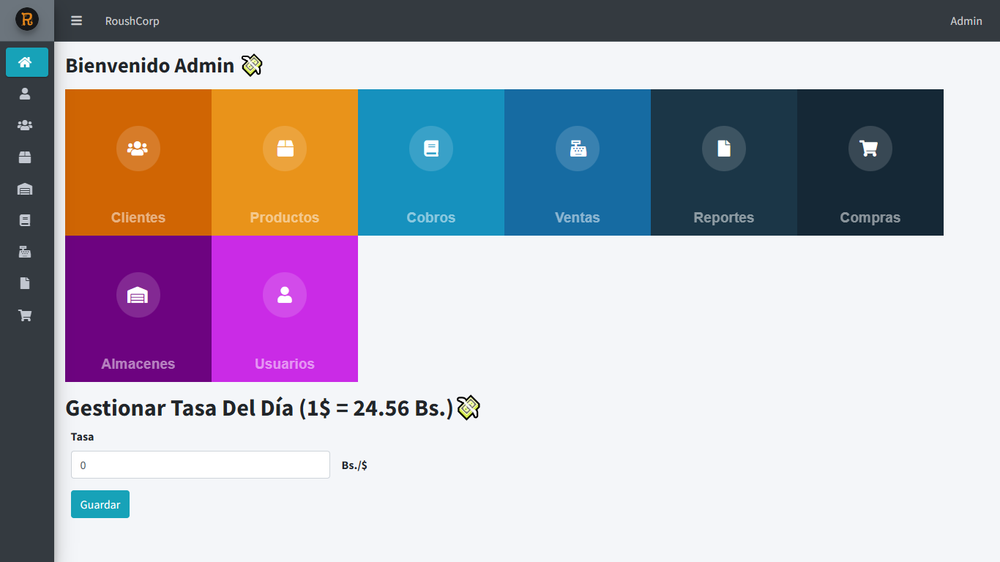

<!--  -->

## Sistema de Ventas

Proyecto de **Sistema para la gestión de ventas** desarrollado con Laravel y Livewire para la materia Desarrollo de Software Avanzado

## Caracteristicas

-   Modulo para gestion de Clientes
-   Modulo de gestion de Inventario
-   Modulo para Gestion de Ventas
-   Modulo de Gestion de Usuarios
-   Modulo Roles y permisos
-   Reportes ventas por día y entre fechas (PDF)

## Arquitectura del proyecto

-   **Modelo Vista Controlador**
    EL Modelo Vista Controlador (MVC), es un patrón de diseño que separa en capas bien definidas el desarrollo de una aplicación, esas partes son tres, el Modelo encargado de la lógica del negocio y la persistencia de los datos, las Vistas son las responsables de mostrar al usuario el resultado que obtienen del modelo a través del controlador, el Controlador encargado es el encargado de gestionar las peticiones del usuario, procesarlas invocando al modelo y mostrarlas al usuario a través de las vistas.

## Herramientas

Para la codificación de este sistema web se utilizaron las siguientes herramientas tecnológicas:

-   **Laravel**: framework de PHP del lado del _backend_, gratis y de codigo abierto. Brinda un conjunto de herramientas y recursos para el desarrollo de aplicaciones web modernas totalmente personalizadas.

-   **Livewire**: framework para el desarrollo de componentes Laravel que pueden comunicarse automaticamente entre la vista y el controlador, de modo que se produzcan comportamientos dinamicos. Permite realizar componentes con programacion Javascript avanzada, pero sin necesidad de escribir codigo del lado cliente.

-   **Blade**: las vistas son la parte publica que el usuario de nuestro sistema puede ver(_frontend_). Para esto se usa Blade, el motor de plantillas de Laravel. Una plantilla por lo general contiene el head del HTML, las ligas del CSS del sistema y una seccion para los archivos Javascript.

-   **Base de datos**
    La basse de datos usada es MySQL manejada a traves del ORM de Laravel Eloquent.

## Requisitos previos

-   Instalar un entorno de desarrollo como [Xamp](https://www.apachefriends.org/es/download.html), [Wamp](https://www.wampserver.com/en/) o [Laragon](https://laragon.org/download/index.html)
-   Luego instalar [Composer](https://getcomposer.org/download/) de manera global
- Instalar [Node JS](https://nodejs.org/es/download) de manera global
-   Tener instalado GIT

## Instalación

Siga estos pasos para la instalación:

-   Clonar desde github

(usando la linea de comandos)

```bash
  git clone https://github.com/YamiDark20/Roushcorp.git
```

(o usando github desktop)

```bash
  gh repo clone YamiDark20/Roushcorp
```

-   Vaya a la carpeta del proyecto

```bash
  cd Roushcorp
```

-   Instalar dependencias con composer desde consola

```bash
  composer install
```

-   Instalar dependencias node

```bash
  npm install
```

-   Generar archivo .env

```bash
  cp .env.example .env
```

-   Generar el APP_KEY, se necesita ejecutar el siguiente comando:

```bash
  php artisan key:generate
```

## Ejecutar Localmente

Ejecutar las migraciones y datos de prueba

```bash
  php artisan migrate:fresh --seed
```

Iniciar el server

```bash
  php artisan serve
```

#

Ir a

[http://127.0.0.1:8000](localhost)

Usuario para prueba como Administrador:

```bash
    user: admin@example.com
    pass: admin@example.com
```

## Screenshots

## Acceso al sistema


### Inicio



### Agregar Producto


### Lista de Productos


### Agregar Cliente


### Agregar Almacen


### Registrar Usuario


### Vender


### Reporte de ventas


